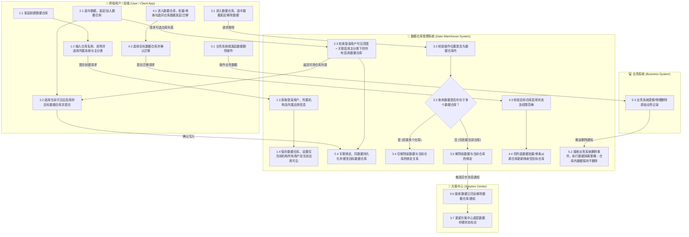

# 数据仓库管理系统V3.1-prd-V3.1

## 1. 版本说明

| 文档版本 | 更新时间 | 部门 | 责任人 | 审核人 | 更新说明 |
| :--- | :--- | :--- | :--- | :--- | :--- |
| V3.0 | 2026-09-02 | 产品部 | 产品经理 | 研发总监 | 补充前端V8/H5收藏动作、全面细化MT看板多维图表、补充编辑日志及回滚机制、完善对接与建库要求。 |
| V3.1 | 2026-09-04 | 产品部 | 产品经理 | 研发总监 | 新增数据仓库创建、加入、移除（多仓判断与通知方案中心）、迁移及业务系统删除隔离规则，绘制全流程泳道图。 |

---

## 2. 本轮需求变更记录

| 变更点 | 变更时间 | 变更来源 | 变更说明 |
| :--- | :--- | :--- | :--- |
| 仓库全生命周期管控规则 | 2026-09-04 | 业务需求 | 明确数据仓库创建可见性（机构+应用可见）、加入限制（仅可见及启用的仓库可选）、移除逻辑（判断多仓存在性，唯一存在时通知方案中心）、迁移逻辑（只允许仓库内单条/批量迁移）以及业务系统数据删除隔离机制。 |
| 业务流程泳道图 | 2026-09-04 | 产品设计 | 绘制涵盖“终端用户/前端”、“数据仓库管理系统”、“业务系统”、“方案中心”多方协同的交互泳道图。 |

---

## 3. 需求概述

### 3.1 需求背景

随着公司业务的发展，数解舆情V8和谛听预警等多条业务线积累了大量的客户数据与收藏行为。当前各业务系统独立管理分类和收藏，缺乏统一的数据基座和精细化的权限管控，导致情报数据流转效率低、无法进行统一运营分析，存在数据越权外泄的风险。为了解决数据孤岛、粗放授权的问题，启动本数据仓库管理系统（MT管理后台及收藏管理体系）项目。

### 3.2 业务现状与建设必要性

**业务现状**：
1. **数据孤岛**：各业务线独立维护主分类，缺乏统一的数据分类字典。
2. **权限粗放**：缺乏从“机构”到“具体员工”及“所属应用”的精细化权限管控，涉密情报分发存在越权和外泄风险。
3. **缺乏反哺与联动机制**：终端用户的收藏偏好未能沉淀，数据移除与迁移逻辑不统一，且与方案中心缺乏状态通知机制。
4. **数据生命周期无隔离**：业务系统删除原始数据时影响仓库留痕，缺乏标准化隔离规则。

**建设必要性**：
本系统的建设能够构建标准化、安全的数据分发网络，打破业务壁垒。通过精细化的多租户权限管控确保数据安全，配合健全的生命周期（创建、加入、移除通知方案中心、迁移、删除隔离），驱动业务反哺，为后续以OpenAPI或SaaS形态开放奠定标准化集成基础。

### 3.3 业务需求

1. **统一分类与仓库管理**：实现全局主分类管理及针对不同机构客户的数据仓库配置。
2. **仓库创建与可见范围隔离**：维护数据仓库名称及说明，仓库仅对登录用户所属机构所有用户及所属应用可见。
3. **精准加入仓库**：基于登录用户可见范围及关联的启用主分类和启用仓库进行数据挂载存储。
4. **仓库数据移除与方案中心联动**：只可在仓库中发起移除；若数据挂载在多仓库则仅解绑当前仓库，若为唯一仓库则移除后同步通知方案中心更新存储状态。
5. **数据仓库内迁移**：支持在仓库中单条或批量将同仓库数据迁移至其他目标仓库。
6. **业务系统删除隔离**：业务系统物理或逻辑删除数据时，数据仓库中已存储数据保持不受影响，不进行联动删除。

### 3.4 业务目标

1. **统一数据基座**：实现核心业务线主分类字典100%统一化管理，打破业务数据孤岛。
2. **安全隔离**：实现机构、应用及人员级别千人千面的权限隔离，涉密数据越权事件发生率降至0%。
3. **数据留痕与状态闭环**：实现仓库与方案中心的数据移除状态精准通知，保障业务数据完整性。

---

## 4. 功能概览与架构

### 4.1 系统架构图

系统整体由前端应用（V8 PC端、H5微端）、MT管理后台及底层数据仓库构成。
- **前端应用层**：提供收藏与仓库管理组件，支持用户创建仓库、加入仓库、移除及迁移交互。
- **MT管理后台层**：提供综合看板、主分类管理、客户数据仓库、客户收藏数据、来源应用配置。
- **底层服务及外部系统**：对接统一用户中心（SSO）进行权限验证，对接方案中心实现数据移除通知，与各业务系统保持删除隔离。

### 4.2 功能清单

| 序号 | 模块 | 子模块 | 功能 | 功能描述 | 版本号 | 优先级 | 备注 |
| :--- | :--- | :--- | :--- | :--- | :--- | :--- | :--- |
| 1 | 前端应用 | 仓库组件 | 创建数据仓库 | 根据所属系统、主分类及登录用户维护名称/说明，设置机构与应用可见 | V3.1 | 高 | 新增 |
| 2 | 前端应用 | 收藏/存储组件 | 加入数据仓库 | 根据可见范围及系统关联的启用主分类/启用仓库选择加入 | V3.1 | 高 | 新增 |
| 3 | 前端应用 | 仓库组件 | 移除数据仓库 | 仅仓库内可操作；多仓仅解绑，单仓解绑并通知方案中心数据已移除 | V3.1 | 高 | 新增 |
| 4 | 前端应用 | 仓库组件 | 数据仓库迁移 | 仅仓库内可操作；支持批量/单条将同仓库数据迁移至另一仓库 | V3.1 | 高 | 新增 |
| 5 | 数据仓库 | 存储策略 | 业务删除隔离 | 业务系统删除数据时，数据仓库中对应数据保持不删除 | V3.1 | 高 | 新增 |
| 6 | MT后台 | 综合看板 | 宏观数据大盘 | 顶指标统计、新增趋势、用户活跃分布、热度排行等 | V3.0 | 中 | |
| 7 | MT后台 | 主分类管理 | 分类字典维护 | 主分类CRUD及带快照的日志回滚机制 | V3.0 | 高 | |
| 8 | MT后台 | 客户数据仓库 | 仓库分配与授权 | 给机构分配仓库并设置人员级与应用级可见范围 | V3.0 | 高 | 核心 |
| 9 | MT后台 | 来源应用配置 | 外部源管理 | 配置外部应用的AppKey、限流QPS及回调地址 | V3.0 | 高 | |

---

### 4.3 业务流程泳道图

系统涵盖 **终端用户/前端**、**数据仓库管理系统**、**业务系统**、**方案中心** 四个角色的协同交互，全生命周期业务泳道图如下：

---

## 5. 用户角色与使用场景

### 5.1 用户角色表

| 部门以及角色 | 描述 | 主要诉求 |
| :--- | :--- | :--- |
| 终端用户 | 使用V8 PC端或H5移动端浏览情报及使用数据仓库的最终用户 | 便捷创建仓库，安全地将情报加入、迁移或移除仓库，确保存储数据不受业务删单影响 |
| MT后台管理员 | 负责统筹分类和数据分发的运营人员 | 统一维护底层字典，按机构与应用分配仓库权限，掌控全局指标 |
| 方案中心 | 公司核心方案与数据存储调度中枢 | 及时接收数据完全从仓库移除的通知，同步更新底层方案存储状态 |

### 5.2 使用场景

> **场景一：创建与可见性**：分析师张三在V8端创建名为“华南新能源”的数据仓库，选择“金融”主分类。系统自动绑定该仓库仅对张三所在的“华南分公司”机构全员及“数解舆情V8应用”可见。
> 
> **场景二：选择加入**：张三在浏览舆情文章时点击加入仓库，下拉框仅展示张三可见范围且处于“启用”状态的仓库，点击提交后完成存储。
> 
> **场景三：移除与通知**：张三在仓库中移除某篇研报。系统检测到该研报同时存在于“宏观仓库”和“新能源仓库”，则仅从“新能源仓库”移除，不通知方案中心；若该研报仅在此仓库存在，移除后系统向方案中心发送通知：“该数据已完全从仓库移除”。
> 
> **场景四：仓库内迁移**：张三在仓库A中批量勾选10条情报，选择“迁移至仓库B”，系统安全地将10条数据的关联关系一次性变更至仓库B。
> 
> **场景五：业务删除隔离**：业务员在源业务系统中删除了某条预警信息，数据仓库中的对应数据依然完整保留，满足审计留痕要求。

---

## 6. 功能设计

### 6.1 数据仓库全生命周期管理（V3.1）

#### 6.1.1 创建数据仓库规则
- **交互与维护**：用户提供数据仓库名称、数据仓库说明，并选择所属系统及仓库主分类。
- **可见范围隔离**：新建的数据仓库，默认且仅对**当前登录用户所属机构的所有用户**以及**当前所属应用**可见，其他机构或应用无法检索或使用。

#### 6.1.2 加入数据仓库规则
- **检索逻辑**：点击“加入数据仓库”时，系统按以下规则过滤可选仓库下拉列表：
  1. 主分类处于“启用”状态；
  2. 所属系统与当前应用匹配；
  3. 数据仓库本身处于“启用”状态；
  4. 仓库在当前登录用户的权限可见范畴内（所属机构及所属应用匹配）。
- **存储逻辑**：用户选中仓库后，系统建立数据与仓库的关系映射并完成存储。

#### 6.1.3 移除数据仓库规则
- **入口限制**：移除操作**只可在数据仓库内**进行，业务列表或其它模块禁止直接执行仓库移除操作。
- **多仓校验与处理**：
  - 对某条数据执行移除时，系统计算该数据挂载的仓库数量。
  - **若存在于多个数据仓库**：仅解除当前数据仓库与该数据的映射关联，不触发外部通知。
  - **若仅存在于当前数据仓库**：解除映射关联后，系统自动发送异步通知至**方案中心**，告知该数据存储已从数据仓库中完全移除。

#### 6.1.4 数据仓库迁移规则
- **入口限制**：迁移操作**只可在数据仓库内**进行。
- **批量/单条迁移**：支持单选或批量勾选处于**同一数据仓库**中的数据。
- **迁移逻辑**：用户选择目标数据仓库（须满足启用及可见性校验），系统将选中数据的仓库归属关系整体更新至目标仓库。

#### 6.1.5 业务系统数据删除隔离规则
- **隔离策略**：当外部业务系统（如数解舆情V8、谛听预警系统）对原始业务数据执行物理删除或逻辑删除时，数据仓库系统**不进行联动删除**，仓库内数据继续保留，确保仓库资产完整性与历史数据可追溯性。

#### 6.1.6 功能详述表

| 功能点 | 操作 | 结果 | 异常描述 |
| :--- | :--- | :--- | :--- |
| 创建数据仓库 | 输入名称、说明，选择所属系统及主分类 | 1、校验名称非空与唯一性 2、保存数据仓库记录 3、限定仅当前登录用户所属机构及应用可见 | 1、仓库名称重复提示“名称已存在” 2、未选择主分类提示“请选择仓库主分类” |
| 加入数据仓库 | 在数据列表/详情点击加入仓库，选择仓库提交 | 1、系统加载符合可见范围且启用的仓库列表 2、选中后建立数据关联并持久化存储 | 1、若无可用仓库，提示“暂无可用数据仓库，请先创建” |
| 移除数据仓库 | 在数据仓库内，对指定数据点击“移除” | 1、校验该数据挂载仓库数 2、多仓存在：仅解绑当前仓库 3、单仓存在：解绑当前仓库并异步通知方案中心 | 1、非仓库内入口发起提示“请在数据仓库中执行移除操作” 2、网络异常提示“移除失败” |
| 数据仓库迁移 | 在数据仓库内批量/单条勾选数据，点击“迁移”选择目标仓库 | 1、校验目标仓库可见性与启用状态 2、更新选中数据的仓库关联至目标仓库 3、刷新当前仓库列表 | 1、选择原仓库作为目标仓库提示“不能迁移至相同仓库” |
| 业务删除隔离 | 业务系统触发数据删除事件 | 1、仓库接收日志/通知，但不删除仓库中数据 2、保持仓库数据的独立存储 | 无 |

---

### 6.2 综合看板 (MT后台)（V3.0）

#### 6.2.1 功能描述
全局数据大屏，采用多维图表展示数据资产沉淀状态和业务回款等信息，供管理员宏观掌控系统运营状态。
#### 6.2.2 功能详述
| 功能点 | 操作 | 结果 | 异常描述 |
| :--- | :--- | :--- | :--- |
| 查看核心指标卡 | 登录并默认进入综合看板页 | 1、展示总仓库数、已挂载客户数据数等核心指标卡 2、自动渲染各项图表（如每日新增走势、24小时峰谷热力图、渠道全景等） | 无 |
| 区域指标联动筛选 | 切换顶部右侧的“区域筛选”下拉框 | 1、页面所有组件与图表重新发起请求，按选中区域刷新数据 | 无 |

---

### 6.3 主分类管理 (MT后台)（V3.0）

#### 6.3.1 功能描述
系统最底层的数据字典基座，维护标准化的行业/话题分类（如金融、汽车）。所有分发数据必须挂载在其之下。
#### 6.3.2 功能详述
| 功能点 | 操作 | 结果 | 异常描述 |
| :--- | :--- | :--- | :--- |
| 新增/编辑分类 | 在弹窗中填写分类名称、描述并提交 | 1、分类名称失焦（onBlur）时异步请求校验是否重名 2、提交保存成功，更新列表数据 | 1、若该分类“已分配客户数>0”，则输入框置灰，不允许修改分类名称 |
| 历史日志回滚 | 点击操作列“历史日志”，在右侧抽屉中选择某次快照版本点击“一键回滚” | 1、弹出二次确认框 2、确认后，系统将该主分类字段恢复至选定的历史快照版本 | 无 |

---

### 6.4 客户数据仓库 (MT后台)（V3.0）

#### 6.4.1 功能描述
核心业务模块。将主分类数据以自定义名称分配给机构，并支持细粒度的人员及应用可见范围权限配置。
#### 6.4.2 功能详述
| 功能点 | 操作 | 结果 | 异常描述 |
| :--- | :--- | :--- | :--- |
| 配置可见范围权限 | 选择可见范围模式（全机构/指定人/仅本人）及所属应用绑定 | 1、选中指定人/仅本人时展开人员选择面板 2、设置仓库归属机构及应用可见隔离规则 | 1、必填校验失败时Toast提示 |

---

### 6.5 来源应用配置 (MT后台)（V3.0）

#### 6.5.1 功能描述
定义外部数据源（如爬虫、模型引擎）接入MT系统的认证密钥与限流规则。
#### 6.5.2 功能详述
| 功能点 | 操作 | 结果 | 异常描述 |
| :--- | :--- | :--- | :--- |
| 密钥重置与日志回滚 | 点击掩码密钥后方的“重置密钥”按钮 | 1、二次确认后重新生成AppKey/Secret 2、操作记录写入历史日志供追溯和回退 | 无 |

---

## 7. 与相关系统的对接

| 对接系统名称 | 对接用途 | 对接部门 | 对接负责人 | 对接优先级 |
| :--- | :--- | :--- | :--- | :--- |
| 方案中心 (Solution Center) | 当数据从所有仓库中完全移除时，接收仓库发送的通知消息，同步更新方案数据存储状态 | 研发部 | 我方：数据组 / 对方：方案组 | 高 |
| 业务系统（数解舆情/谛听） | 数据删除事件推送与单向隔离；数据加入仓库拉取与展现 | 研发部 | 我方：研发组 | 高 |
| 统一用户中心（SSO） | 获取机构人员清单及所属应用信息，用于仓库可见范围校验 | 研发部 | 我方：研发组 | 高 |

---

## 8. 非功能描述

### 8.1 性能需求
1. 核心图表与接口响应时间 ≤ 1s（覆盖95%请求）。
2. 批量数据迁移（支持一次性100条以内数据）响应时间 ≤ 1.5s。
3. 列表查询（含亿级底层数据关联及筛选）响应时间 ≤ 2s。

### 8.2 安全需求
1. **可见范围隔离**：严格按“登录用户所属机构 + 所属应用”双维度实施仓库访问控制，禁止越权跨机构或跨应用读取数据。
2. **操作审计**：仓库创建、移除、迁移等全生命周期动作须记录 Audit Log，包含操作人、时间、原仓库、目标仓库及相关数据ID。

### 8.3 兼容性需求
1. 泳道图及组件适配 PC 端与移动端显示，支持响应式渲染。

---

## 9. 补充说明

本系统在研发实施阶段，底层数据库设计要求包含但不限于以下核心物理表设计：
1. `mt_main_category`（主分类表）
2. `mt_customer_repo`（客户数据仓库表：包含 `org_id`, `app_id` 机构及应用绑定字段）
3. `mt_user_favorites`（客户收藏/存储明细表）
4. `mt_repo_data_relation`（仓库与数据多对多关联表）
5. `mt_audit_logs`（通用编辑日志表，含快照与迁移履历）

未尽事宜将在技术详审阶段及冲刺（Sprint）计划会议中补充说明。
