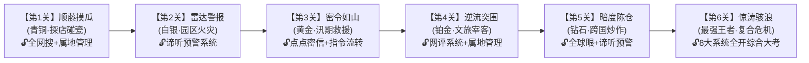

# 《风暴中枢：全域舆情应急作战推演系统》
## 业务汇报与产品方案 PPT 完整讲义与视觉方案

---

## 幻灯片 1：封面页（震撼开场）

### 【页面视觉呈现】
* **背景基调**：深蓝黑底高科技大屏风格，正中央为动态微光的“全域舆情雷达拓扑”，周围环绕 8 大系统科技感徽标与金色王者结算勋章。
* **主标题**：**风暴中枢 · 全域舆情应急推演作战系统**
* **副标题**：从“被动学系统”到“主动打通关”——基于游戏化实战与 AI 动态生态的现象级演练平台
* **汇报单位**：舆情演练系统专项研发组
* **汇报时间**：2026年

### 【核心展示内容】
* **三大创新抓手**：
  * **第一视角全景推演**：身临其境体验“生产、传播、跟踪、处置”全生命周期。
  * **现有八大系统合一**：全盘盘活、无缝嵌入现有 8 大应用生态。
  * **电竞机制驱动增长**：天梯排位、英雄联盟式结算、V8 权威认证证书，激发全员自主参演。

### 【现场汇报逐字稿】
> “各位领导，今天我向大家汇报的是《风暴中枢：全域舆情应急推演作战系统》。  
> 过去我们推广软件，往往需要给各级干部下发操作手册、组织填鸭式培训，用户学了就忘，平时不爱用，战时不会用。  
> 今天我们要汇报的这款全新系统，彻底换了一个逻辑：**把培训做成游戏，把 8 大系统做成闯关神装，把全省演练做成天梯排位赛**。让用户像打王者一样比着玩、上瘾玩，甚至拉着整个科室的同事组队来玩，在一次次惊心动魄的通关中，真正锻造出全流程舆情应急实战能力！”

---

## 幻灯片 2：痛点分析与破局思路

### 【页面版式设计】
* **左侧：传统培训三大痛点（红色警示色块）** vs **右侧：游戏化破局三大升级（科技蓝绿色块）**

```
  传统模式困局 (Pain Points)                 风暴中枢破局之道 (Innovations)
┌─────────────────────────────────┐       ┌─────────────────────────────────┐
│ 1. 形式枯燥，被动应付          │  ==>  │ 1. 闯关游戏化，主动上瘾         │
│   手册式培训，学完就忘，缺乏黏性│       │   关卡推进、勋章激励、战队争霸   │
├─────────────────────────────────┤       ├─────────────────────────────────┤
│ 2. 产品孤岛，利用率低          │  ==>  │ 2. 8大系统化身“作战神装”       │
│   各应用相互割裂，用户只用单点  │       │   按关卡逐步解锁，熟练掌握全生态│
├─────────────────────────────────┤       ├─────────────────────────────────┤
│ 3. 静态试题，缺乏实感          │  ==>  │ 3. AI 驱动动态虚拟互联网        │
│   传统预设答案，无法模拟瞬息万变│       │   真实网民情绪，通报实时被挑刺  │
└─────────────────────────────────┘       └─────────────────────────────────┘
```

### 【现场汇报逐字稿】
> “各位领导，我们在调研中发现，当前舆情培训存在三大核心痛点：一是形式枯燥，学员普遍被动应付；二是产品割裂，我们辛辛苦苦研发的多个优秀系统，用户往往只熟悉其中一两个，生态资产被严重闲置；三是模拟太假，单选题无法模拟真实的网民情绪风暴。  
> 针对这些痛点，我们的破局核心就是：**用好玩的游戏化机制把 8 大系统串成一条珍珠项链**，借助生成式 AI 构建‘活’的互联网环境，让学员在应对突发危机中自发爱上这套系统。”

---

## 幻灯片 3：底层作战装备库（8 大系统全功能深度融合）

### 【页面视觉呈现】
* **版式**：中央展示“应急作战控制台工作台”，四周辐射连线至现有的 8 大应用，以“装备卡牌”形式罗列。

| 装备代号 | 对应实际系统 | 系统核心功能（原厂能力） | 游戏内实战操作玩法 |
| :--- | :--- | :--- | :--- |
| **【全域雷达】** | **谛听预警系统** | 设定规则发现监测；根据关键词+时间跨度监测传播与跟踪汇总。 | 捕获突发舆情苗头，监控传播峰值，生成全生命周期事件追踪简报。 |
| **【全网探针】** | **全网搜** | 规则搜索全网舆情信息；**加入收藏、精准打标签**。 | 海量信息中定向打捞证据链，对造谣贴、核心博主打上分类标签。 |
| **【属地中枢】** | **属地管理系统** | 属地自媒体账号（抖音/快手/小红书/公众号/头条等）粉丝与作品维护；属地政府发文监测预警；**发文前错误排查**。 | 筛选首发阵地账号；**在发布通报前进行公文错别字与职务排查“扫雷”**；接收属地发文违规预警。 |
| **【密级通信】** | **点点密信** | 加密通信聊天；发起指令任务、任务处置、群聊推送、监测汇总。 | 沉浸式剧情即时对话，加密调度多部门协同，一键向指挥群推送舆情。 |
| **【指挥流转】** | **指令流转系统** | 指令下发、转发、接收、处置及反馈。 | 规范化应急公文流转，考核部门协同、签批响应与处置反馈时效闭环。 |
| **【认知兵团】** | **网评系统** | 宣传员网评处置：下发任务、接收任务、处置反馈（**点赞、转发、评论、举报**）。 | 组织网评力量对抗网络水军，执行“赞/转/评/报”四维战术疏导民意。 |
| **【境外天眼】** | **全球眼** | 境外规则监测；深度挖掘境外舆情事件传播、发展过程。 | 监控推特、YouTube等境外社交媒体，深度挖掘境外源头推文与倒灌链路。 |
| **【权限总控】** | **V8 平台** | 机构/外部用户与应用权限管理、单点登录。 | 演练学员统一单点登录入口，随关卡逐步解锁高阶权限，出具权威认证。 |

### 【现场汇报逐字稿】
> “请领导放心，我们这项系统**完全不需要推翻重来，而是全面赋能我们已有的 8 大成熟产品**。  
> 我们将这些系统直接封装为学员桌面上的‘实战神装’。例如，谛听是全域雷达，全网搜是情报探针，属地管理是阵地与发文排错中枢，网评系统是认知作战兵团。用户在推演过程中，每一步都是在真实操作我们的产品功能，真正做到了‘练即是用、用即是练’。”

---

## 幻灯片 4：破冰引擎（新手特训营：绝不让用户盲目探索）

### 【页面视觉呈现】
* **三级无痛上手漏斗示意图**：

```
┌───────────────────────────────────────────────────────────┐
│ 阶梯 1：【5分钟剧情漫游】(消除对新界面的陌生感)              │
│ - 虚拟“老严教官”密信破冰，高亮光圈手把手引导点击各系统       │
├───────────────────────────────────────────────────────────┤
│ 阶梯 2：【单兵战术靶场】(1~2分钟微技能小游戏，即练即爽)     │
│ - 【公文扫雷】(属地排错) | 【探针打靶】(全网搜打标)        │
│ - 【雷达校准】(谛听规则) | 【网评四连击】(网评四维反击)     │
├───────────────────────────────────────────────────────────┤
│ 阶梯 3：【战前简报 + 局中AI提示】(全流程保姆级防卡关)        │
│ - 关卡前明确核心战术路线；超过30秒无操作，AI教官智能气泡提示│
└───────────────────────────────────────────────────────────┘
```

### 【现场汇报逐字稿】
> “很多软件培训系统之所以失败，是因为一上来就把复杂界面丢给用户，导致用户无从下手而放弃。  
> 我们特设了**三级渐进式指引体系**：  
> 刚进系统，有 5 分钟手把手光圈漫游，教官带着熟悉界面；  
> 接着进入‘单兵靶场’，把各个系统的核心功能做成 1 分钟解谜小游戏，比如‘公文扫雷’练习发文前排错，‘探针打靶’练习精准打标签；  
> 进入正式关卡后，还有战前战术简报和超 30 秒卡关 AI 自动提醒。**彻底杜绝了盲目乱点，让即使是电脑操作不熟练的基层网评员也能顺畅通关。**”

---

## 幻灯片 5：关卡递进路线图（由浅入深的系统解锁体系）

### 【页面视觉呈现】
* **版式**：采用战役地图进阶树（Campain Map）形式呈现，标明段位、事件与解锁装备。



### 【通关核心机制】
* **目标导向**：每个关卡设定 3 个硬性指标（如“舆情峰值压制在80%以内”、“完成全流程指令闭环”、“公信力保留85分以上”）。
* **解锁限制**：只有达成当前关卡目标，才能解锁下一关及后续高级应用系统，建立持续探索欲望。

### 【现场汇报逐字稿】
> “在关卡设计上，我们设置了 6 个由浅入深的实战场景。  
> 从第 1 关的自媒体维权，用户只需掌握‘全网搜’和‘属地管理’；到第 2 关学会用‘谛听’看趋势；第 3 关学会用‘密信’和‘指令系统’下发处置；第 4 关使用‘网评系统’反击水军；第 5 关用‘全球眼’粉碎境外渗透；直至最后一关 8 大系统全开，应对重特大复合型突发事件。  
> **6 关打通，学员不仅玩通了一个游戏，更是完整掌握了我们整套产品体系的全部精髓！**”

---

## 幻灯片 6：核心玩法创新（双重视角 + AI 动态互联网生态）

### 【页面视觉呈现】
* **画中画工作台截图**：
  * **主屏（70% 区域）**：指挥官工作台（8 大系统操作界面、指令公文、密信消息）；
  * **副屏（30% 区域）**：高拟真智能手机屏幕（实时展示微博热搜榜、抖音评论区、网民弹幕）。

### 【两大核心创新体验】
1. **双重视角画中画机制（AVG 文字冒险沉浸感）**：
   * 学员不仅在操作软件，更是身处演练前线。在后台下达一条指令，右侧手机屏幕的网民评论流便瞬时产生波澜，给予学员最直观的心理震撼。
2. **生成式 AI 构建“活”的网民与通报评判器**：
   * **动态挑刺**：通报若存在套话或错别字，AI 网民立刻发帖群嘲，公信力大跌；
   * **非固定结局**：每一个决策分支都会实时演化出不同的舆论走向，支持无限次重玩与反思。

### 【现场汇报逐字稿】
> “传统演练最让人出戏的，就是‘点一下按钮、弹一个结果’的假流程。  
> 我们这次加入了**双重视角设计**：学员在幕后操作 8 大系统，屏幕右边常驻一个仿真手机，实时滚动网络舆论。  
> 背后由**大语言模型**支撑——如果通报发布前在‘属地管理’里漏改了一个错别字，AI 网民在手机屏幕上就会立刻疯狂挑刺，舆情瞬间二次爆炸！这种惊心动魄的现场感，能让学员真正产生敬畏之心，养成发布前必过审核、处置必讲实效的专业习惯。”

---

## 幻灯片 7：电竞式战力结算大屏（英雄联盟手游风格）

### 【页面视觉呈现】
* **全屏仿 LOL 手游结算界面**：金色胜利徽章、S+ 评级、五维战力雷达图、局后 AI 诊断报告。

```
====================================================================================
                              VICTORY  通关达成！
                      【关卡评级：S+ 破浪大师】（击败全网 95% 学员）
====================================================================================
  学员代号: 守网卫士_01       通关关卡: 第4关-逆流突围              耗时: 06分15秒
------------------------------------------------------------------------------------
  【五维战斗力雷达图】                       【本局高光对局数据】
         [敏锐侦察(全网搜/全球眼)]               - 舆情情绪反转率: +76% (负面转正面)
                 ★ 96                          - 属地通报排错准确率: 100% (揪出3个高危错)
                 /  \                          - 黄金时效响应: 04分15秒 (评级: S)
  [公文严谨] ★       ★ [监测预警(谛听)]        - 网评“赞/评/转/报”闭环达成率: 100%
  (属地排错)  98 \    /     92                  - 指令流转完成耗时: 1分20秒 (评级: S)
               ★                               - 公信力总留存: 94 / 100
         [协同引导(密信/指令/网评)]
                 88
------------------------------------------------------------------------------------
  【AI 战力诊断室 / 弱项提升建议】(Coach Analysis)
  ----------------------------------------------------------------------------------
  ⚠️ 弱项归因：【指令流转系统】耗时偏高（评级为 A-）。
               你在第 2 阶段接收到现场核查反馈后，滞留超过 3 分钟未回填流转，导致部门
               协同率被扣分。下一关建议关注指令快速催办！
====================================================================================
```

### 【现场汇报逐字稿】
> “大家看这个结算界面，我们完全参考了《英雄联盟手游》等成熟电竞的战力结算。  
> 它不仅给出 S+ 或 A 等清晰评级，更能通过五维雷达图直观展现学员的短板：是【全网搜】打标不准？还是【属地管理】公文排错漏了？抑或是【指令流转】超时延误？  
> **底部的 AI 诊断室会给出针对性的提升建议，直接指出哪套系统用得弱**，促使学员主动去靶场加练，把 A 刷成 S+！”

---

## 幻灯片 8：用户自发暴涨的秘诀（天梯排位、权威认证与社交裂变）

### 【页面视觉呈现】
* **三大增长裂变抓手展示**：

```
+-----------------------------------------------------------------------------------------+
|  【裂变驱动 1：全域天梯排行榜】     |  【裂变驱动 2：V8权威防伪通关证书】   |  【裂变驱动 3：趣味成就勋章墙】   |
|  - 个人百强榜 (争夺全省第1)        |  - V8 官方认证电子印章               |  - “一眼假识破者”(全球眼)   |
|  - 机关战队榜 (XX市宣传部战队)      |  - 自动折算年度业务继续教育学时      |  - “火眼金睛排雷手”(属地排错)|
|  * 5人组队享20%团队加成，倒逼       |  - 一键生成朋友圈炫耀长图，吸引      |  - “水军粉碎机”(网评举报)   |
|    各单位领导主动拉全员注册组队！   |    兄弟单位自发找上门参演！          |  - 激发干部全收集上瘾感！    |
+-----------------------------------------------------------------------------------------+
```

### 【机制深度说明】
1. **战队榜裂变机制**：设置“5人组队享团队总积分加成”。各科室为了在本区、本市战队榜名列前茅，会自发拉动新同事注册，**实现零成本裂变拉新**。
2. **权威认证与硬通货**：通关由 V8 平台认证电子证书，与干部业务考核与学时挂钩，既有荣誉感，更有制度硬约束。

### 【现场汇报逐字稿】
> “如何让各级单位主动来用、主动拉人来用？靠这三大杀手锏：  
> 第一是**机关战队榜**。当系统推出‘全省机关争霸赛’，规定 5 人组队有额外积分加成时，各个单位的处长、科长为了本部门荣誉，就会自上而下组织全科室注册打比赛；  
> 第二是**V8 权威通关证书**，具备防伪编号，可以作为年度培训学时的硬性凭证；  
> 第三是支持一键生成炫酷的战报长图分享至朋友圈。**把过去的‘要我学’，彻底变成了‘我要玩、我要赢、我们单位要争第一’！**”

---

## 幻灯片 9：商业与业务综合价值（领导最关心的成果产出）

### 【页面视觉呈现】
* **三维效益金字塔**：

```
                      / \
                     /   \
                    / 战时 \
                   / 胜仗力 \ 
                  /───────────\
                 /  业务生态价值  \
                / 盘活8大系统全资产 \
               /─────────────────────\
              /     商业与用户规模     \
             /  指数级获客 / 极高黏性与活跃 \
            └─────────────────────────┘
```

1. **业务安全效益**：“平时多流汗，战时少翻车”。通过高频次逼真演练，全面提升干部网络素养与公文发声严谨度，极大减少次生舆情发生。
2. **产品资产效益**：化零为整，将原本分散在各处、使用频次不均的 8 大系统有机融合，使整个产品矩阵的综合价值翻倍。
3. **品牌与规模效益**：打造行业内首个“游戏化+全生态”的标杆级舆情应急演练平台，成为对外展示的杀手级门面产品，吸引更多体制内客户采购与入驻。

### 【现场汇报逐字稿】
> “总结来说，做这套系统对我们有着三大核心价值：  
> 在业务上，它为防范化解意识形态风险提供了一套实战抓手；  
> 在产品上，它一举盘活了我们多年沉淀的 8 大系统资产；  
> 在市场上，它具有极强的差异化竞争壁垒和裂变属性，能为我们带来海量的活跃用户与行业标杆影响力！”

---

## 幻灯片 10：推进路线建议（低风险、快见效落地法）

### 【页面视觉呈现】
* **三阶段实施甘特图与里程碑**：

| 阶段 | 周期 | 核心交付物 | 达成目标 |
| :--- | :--- | :--- | :--- |
| **第一阶段：原型与核心体验打样** | 1 个月 | 1 个控制台 Web 外壳 + 1 个靶场小游戏 + 第 1 关【顺藤摸瓜】 | 邀请 20~30 名内部用户封闭试玩，验证通关爽感与结算逻辑。 |
| **第二阶段：系统接入与全生态贯通** | 2 个月 | 8 大系统仿真/API数据贯通 + 6 大完整关卡 + V8 证书体系 | 打造出完整闭环的推演产品，支持个人排位赛。 |
| **第三阶段：首届全省演练争霸赛** | 持续推广 | 开启全省英雄榜、战队排位赛、多机构联合演习 | 组织首届线上争霸赛，引爆行业口碑，实现用户规模裂变式增长。 |

### 【现场汇报结语（总结致谢）】
> “各位领导，目前整套设计思路已经非常清晰，技术路径和业务闭环完全成熟。我们建议先以 1 个月时间快速做出第 1 关的试玩原型，让领导和同事们亲自上手体验打一关。  
> 感谢各位领导聆听，恳请批评指正！”
